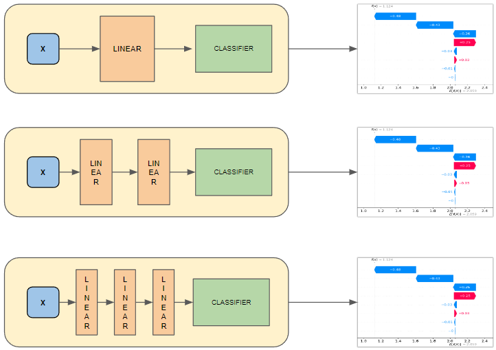

# XAINT: eXplainable AI through Iterative Network Truncation

XAINT is a novel framework designed to enhance the interpretability of neural networks by **iteratively truncating sequential networks**. This approach aims to examine the relationship between network depth and feature relevance, offering insights into how different layers contribute to the model's predictions.

## Table of Contents
- [Introduction](#introduction)
- [How XAINT Works](#how-xaint-works)
- [Installation](#installation)
- [Contributing](#contributing)
- [License](#license)

---

## Introduction

Modern neural networks are often criticized for being opaque, with their decision-making processes hidden in numerous interconnected layers. XAINT addresses this challenge by:
- Iteratively **truncating hidden layers** from the middle of the network.
- Evaluating feature importance at each truncation step.
- Using explainability techniques like **SHAP (SHapley Additive exPlanations)** to quantify feature contributions.

This framework empowers researchers to:
- Better understand layer-wise contributions.
- Visualize how feature importance shifts across model depth.
- Identify redundancies or bottlenecks in their architectures.

---

## How XAINT Works

### Layer Truncation

The core idea of XAINT is **truncation**, where hidden layers are systematically trimmed from the middle, creating a reduced version of the model. This helps isolate and analyze the impact of specific layers on predictions.

**Truncation Example:**


At each truncation step feature importance is calculated using SHAP.

### Explainability with SHAP

SHAP values provide a detailed breakdown of feature contributions, which are visualized as **bar plots** to show the importance of features at each truncation step.

---

## Installation

1. Clone the repository:
   ```bash
   git clone https://github.com/your-username/XAINT.git
   cd XAINT
   ```

2. Install dependencies:
   ```bash
   pip install -r requirements.txt
   ```

---

## Contributing

We welcome contributions to improve XAINT! To get started:
1. Fork this repository.
2. Create a new branch for your feature or bugfix.
3. Submit a pull request with a clear description of your changes.

---

## License

This project is licensed under the Apache 2.0 License. See the [LICENSE](LICENSE) file for details.
